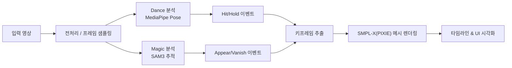
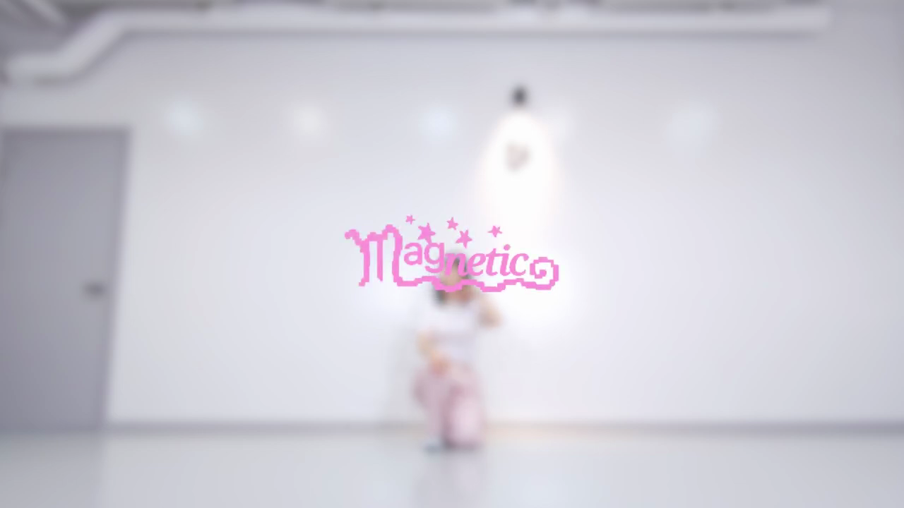
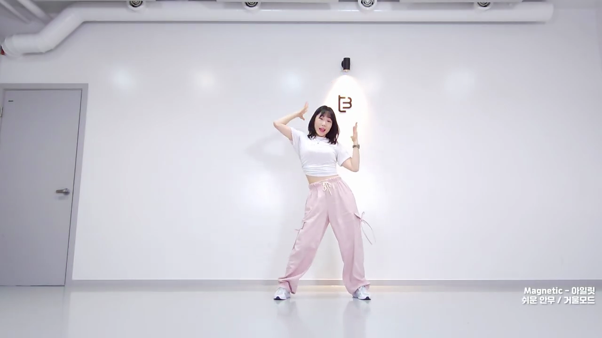

# Dance + Magic Analysis Lab (Hackathon)

## 한줄 요약
춤과 마술 영상에서 **음악의 비트/리듬과 맞는 핵심 순간(타임라인 마커)**을 자동 추출하고, 해당 포즈를 3D 아바타로 시각화해 **musicality를 쉽게 확보**하도록 돕는 분석/가이드 시스템.

## 배경 & 문제
- 마술/댄스 퍼포먼스에서 **타이밍(음악적 억양, 리듬)**이 완성도를 좌우하지만, 연습 과정에서 스스로 타이밍을 객관적으로 잡기 어렵다.
- 기존 영상 분석은 동작 인식 위주라 **음악과의 동기화 지점(‘강세’)**을 정밀하게 찾기 어렵다.

## 목표
- 퍼포먼스 영상에서 **핵심 타이밍 마커**를 자동으로 뽑아내고
- 마커에 해당하는 포즈를 **3D 아바타(SMPL‑X)**로 보여줘
- **연습/리뷰 시 musicality를 빠르게 체득**하도록 돕는다.

## 핵심 아이디어
- **Dance 모드:** 관절 에너지 기반 `Hit / Hold` 이벤트 추출
- **Magic 모드:** 객체 `Vanish / Appear` 이벤트 추출
- 추출된 이벤트를 타임라인에 표시하고, 해당 프레임의 포즈를 3D 메시로 시각화

## 사용자 시나리오
1. 사용자가 댄스/마술 영상을 업로드
2. 시스템이 이벤트 마커를 자동 추출
3. 타임라인에서 마커를 클릭하면 해당 프레임의 3D 포즈 확인
4. 음악과의 싱크 지점에 맞춰 퍼포먼스 수정/연습

## 시스템 구성
- **Backend:** FastAPI (API + Worker)
- **Motion Pipeline:** MediaPipe Pose 기반 동작 분석
- **Magic Pipeline:** SAM3 기반 객체 등장/소멸 감지
- **3D Pose:** SMPL‑X(PIXIE) 메시 렌더링
- **Frontend:** React + Vite + Tailwind + Three.js + Framer Motion

## 파이프라인 요약
- **Dance**
  - 포즈 추출 → 에너지/속도 기반 특징 계산 → Hit/Hold 키프레임 추출
- **Magic**
  - 텍스트 프롬프트 기반 객체 추적 → Appear/Vanish 이벤트화 → 키프레임 추출
- **3D 시각화**
  - 키프레임을 SMPL‑X 메시로 렌더링 → 타임라인에서 확인

## 파이프라인 (머메이드)

## 개발 포인트 (엔지니어링 관점)
- **이벤트 기반 설계:** 연속된 동작/영상 흐름을 `이벤트(마커)`로 압축해 타임라인 중심의 UI/리뷰에 최적화.
- **모듈 분리:** Dance / Magic / 3D 렌더링을 독립 파이프라인으로 분리해 병렬 개발 및 실험이 용이.
- **비용 최적화:** 영상 전체 렌더링 대신 **키프레임만 3D화**하여 GPU 비용과 시간 절감.
- **확장성:** 이벤트 정의만 바꾸면 다른 퍼포먼스(연기, 스포츠)로 확장 가능.
- **프론트-백 분리:** FastAPI + Vite 구조로 개발/배포 분리, 데모 속도 개선.

## 데모 포인트
- 타임라인 마커와 포즈가 1:1 매핑되어 **음악의 강세/박자**를 시각적으로 확인 가능
- **마술의 소실/등장 타이밍**을 객관적으로 잡아낼 수 있음

## 스크린샷 (샘플 키프레임)
> 아래 이미지는 시스템이 추출한 키프레임 스냅샷 예시입니다.

## 현재 상태
- 파이프라인 및 UI 기본 구성 완료
- Dance/Magic 이벤트 추출 가능
- 3D 메시 오버레이 시각화 지원

## 앞으로 개선점
- 음악 분석 모듈과 타임라인 정밀 동기화
- 마커 편집/수정 UI 제공
- 데모 영상 입력/출력 자동화

## 시사점
- **Musicality의 정량화 가능성:** 감각에 의존하던 “타이밍”을 이벤트 단위로 구조화하여 학습/피드백 사이클을 단축.
- **퍼포먼스 교육의 자동화:** 코치 없이도 리듬/강세 지점을 스스로 점검할 수 있어 연습 효율 상승.
- **멀티모달 확장 여지:** 음악 분석(리듬/비트)과 영상 이벤트를 결합하면 고도화된 동기화 피드백 제공 가능.
